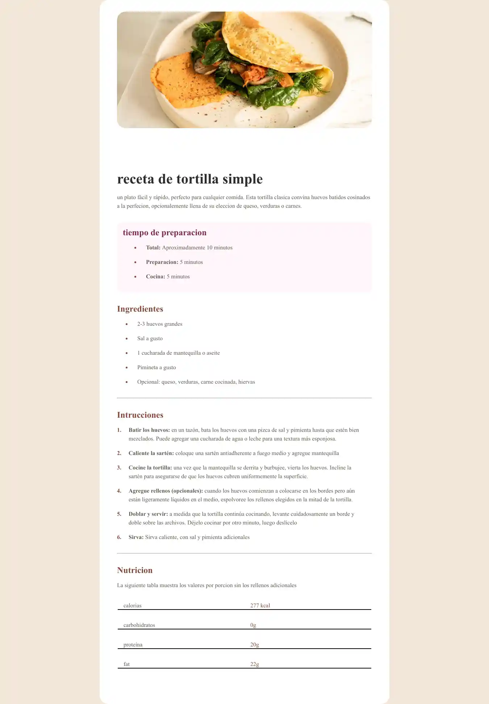

# Frontend Mentor - Solución de la página de recetas

Esta es una solución al [desafío de la página de recetas en Frontend Mentor](https://www.frontendmentor.io/challenges/recipe-page-KiTsR8QQKm). Los desafíos de Frontend Mentor te ayudan a mejorar tus habilidades de codificación construyendo proyectos realistas.

## Tabla de contenidos

- [Visión general](#visión-general)
  - [El desafío](#el-desafío)
  - [Captura de pantalla](#captura-de-pantalla)
  - [Enlaces](#enlaces)
- [Mi proceso](#mi-proceso)
  - [Construido con](#construido-con)
  - [Lo que aprendí](#lo-que-aprendí)
  - [Desarrollo continuo](#desarrollo-continuo)
- [Autor](#autor)
- [Agradecimientos](#agradecimientos)

## Visión general

### Captura de pantalla

### Enlaces

- URL de la solución: [Añadir URL de la solución aquí](https://your-solution-url.com)
- URL del sitio en vivo: [Añadir URL del sitio en vivo aquí](https://your-live-site-url.com)

## Mi proceso

### Construido con

- Marcado HTML5 semántico
- Propiedades personalizadas de CSS
- Flexbox
- CSS Grid
- Flujo de trabajo móvil primero
- [Styled Components](https://styled-components.com/) - Para estilos

### Lo que aprendí

Utiliza esta sección para recapitular algunos de tus aprendizajes principales mientras trabajabas en este proyecto. Escribir estos y proporcionar muestras de código de las áreas que deseas resaltar es una excelente manera de reforzar tu propio conocimiento.

### Desarrollo continuo

Usa esta sección para delinear áreas en las que deseas seguir enfocándote en proyectos futuros. Podrían ser conceptos con los que aún no te sientas completamente cómodo o técnicas que encontraste útiles y que deseas perfeccionar.

## Autor

- Sitio web - [jose kike ](https://github.com/dashboard)
- Frontend Mentor - [jose kike](https://www.frontendmentor.io/profile/josekike819)

## Agradecimientos

Este es el lugar donde puedes dar crédito a cualquier persona que te haya ayudado en este proyecto. Tal vez trabajaste en equipo o te inspiraste en la solución de alguien más. Este es el lugar perfecto para darles crédito.